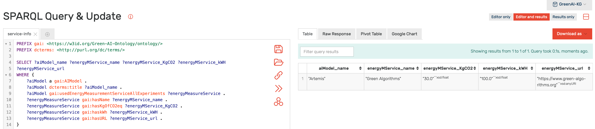
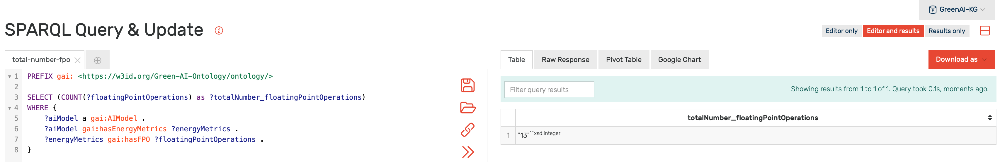
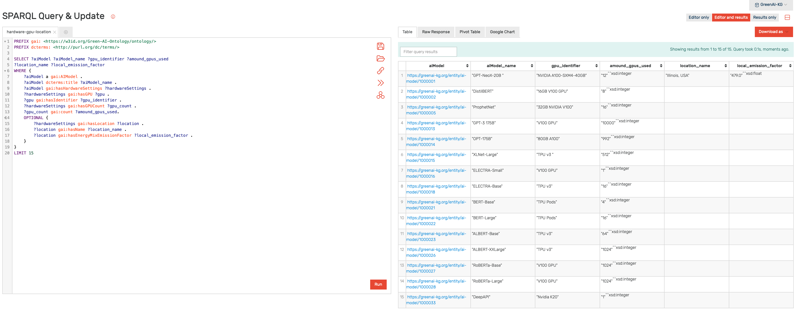
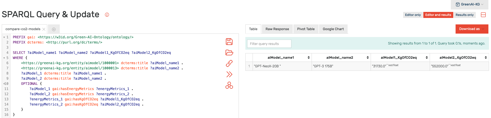

# The Energy Measurement of AI Models Ontology (EMAI)
Modeling AI systems' characteristics of energy consumption and their sustainability level as an extension of the FAIR data principles has been considered only rudimentarily. In this work, we propose an **ontology for modeling the energy consumption and other environmental aspects of AI models**. The ontology can be used in various scenarios, ranging from an improved research data management to strategic controlling of institutions and the implementation of standards. 

Our ontology (OWL file) is available at **http://w3id.org/EMAI/ontology**

The ontology was evaluated based on the competency questions given below. Based on our constructed [EMAI Knowledge Graph](emai-knowledge-graph) we are able to answer all competency questions. The corresponding SPARQL queries and obtained results are in the section **SPARQL Queries**.

If you want to contribute to successively extend our knowledge graph, you can fill in our questionnaire about the energy consumption of AI models: **https://forms.office.com/r/HYd4R9jutX**

# Schema

# Competency Questions
* Q1: How many floating-point operations (FPO) did the AI Model need to be trained?
* Q2: How much kg of CO2eq did the AI Model generate?
* Q3: How long did it take to train the AI Model?
* Q4: How much energy in kWh did the training of the AI model take?
* Q5: What Energy Measurement Services are used to calculate metrics about the AI Model's energy consumption?
* Q6: What energy metrics are used to indicate the energy consumption of an AI Model?
* Q7: How many times was the metric "floating-point operations" (FPO) used to indicate the energy consumption of AI models?
* Q8: What are the hardware settings used for training the AI Model?
* Q9: In which region is the hardware used to train the AI Model? (Background: In a carbon-friendly region?)
* Q10: How many GPUs were used to train the AI Model?
* Q11: Did AI Model A or AI Model B generate more CO2?
* Q12: Which programming language was used to train the AI Model?
* Q13: What software modules were used to train the AI Model?
* Q14: In the context of which research project was the AI Model developed?
* Q15: Which publication does the AI Model have?

# SPARQL Queries

Based on our constructed [EMAI Knowledge Graph](emai-knowledge-graph) we are able to answer all competency questions listed above. In this section you can find the output of the corresponding SPARQL queries using our EMAI Knowledge Graph in[ Ontotext's GraphDB graph database](https://graphdb.ontotext.com).

**[Query #1](sparql-queries/query1-energy-metrics-fpo.txt):** Get the number of floating-point operations (FPO) that were needed to train the AI models. Answers Q1.

**[Query #2](sparql-queries/query2-energy-metrics-co2-runtime-kWh.txt):** Get several energy metrics (emitted CO2 in kg, run time and energy consumption in kWh) that specify the energy consumption of an AI Model. Answers Q2, Q3 and Q4.

**[Query #3](sparql-queries/query3-energy-measurement-services.txt):** Get information about a Energy Measurement Service used. Answers Q5.

**[Query #4](sparql-queries/query4-energy-metrics.txt):** Get the Energy Measurement Metrics that are used. Answers Q6.

**[Query #5](sparql-queries/query5-total-number-fpo.txt):** Get the total number how often the metric floating-point operations (FPO) is used. Answers Q7.

**[Query #6](sparql-queries/query6-hardware-gpu-location.txt):** Get information which GPUs and in which number were used to train the AI Model. If available get information where the hardware was located and the corresponding CO2 emission factor of the location. Answers Q8, Q9 and Q10.

**[Query #7](sparql-queries/query7-compare-co2-two-models.txt):** Compare the amount of emitted CO2 in kg of two AI Models. Answers Q11.

**[Query #8](sparql-queries/query8-software-module-info.txt):** Get informations about the programming language and software modules used to train an AI Model. Answers Q12 and Q13.

**[Query #9](sparql-queries/query9-publication-project-info.txt):** Get several information about the Publications and Research Projects related to the AI Models. Answers Q14 and Q15.

# Related Work
The following papers have been considered for creating the ontology (ranked by decreasing citation count):

